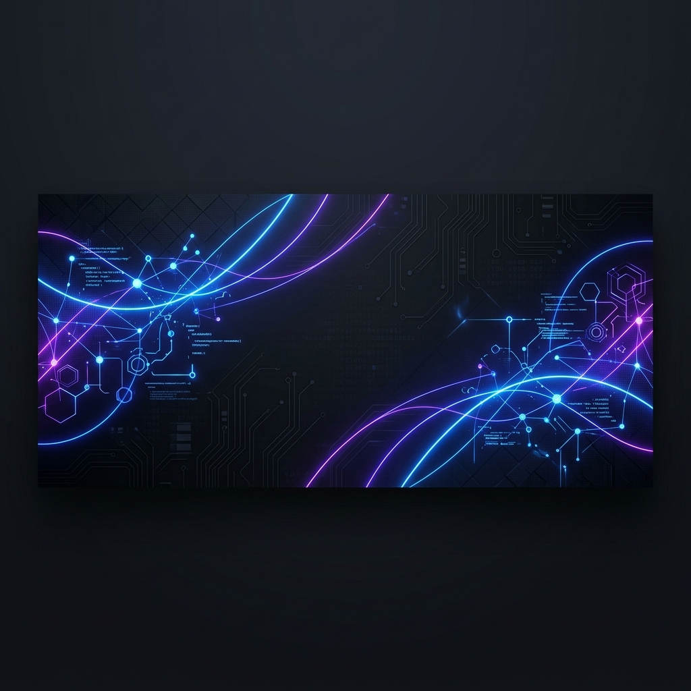
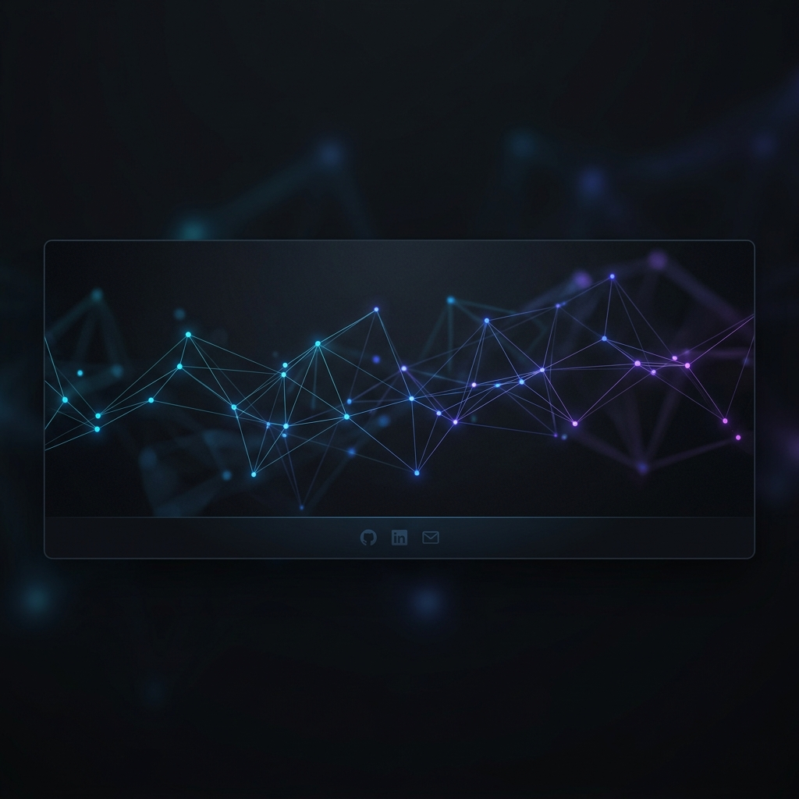

# Welcome to my Digital Portfolio! 🚀

 

  
  
  
  
  

 

---

## 👨‍💻 About Me

Hi 👋, I'm **Kommineni Ravindra**! A passionate **Full Stack Java Developer** from India 🇮🇳 with hands-on experience in building scalable web applications, robust REST APIs, and AI-powered solutions. I love turning complex logic into real-world applications and continuously expanding my technical horizon.

* 🚀 **Currently working on:** Full Stack Java Development projects using Spring Boot, React.js, Node.js, Express.js, and MongoDB.
* 🤝 **Looking to collaborate on:** Open Source initiatives, Java/Spring Boot ecosystems, MERN Stack applications, and AI-integrated web platforms.
* 🌱 **Currently learning:** Microservices architecture, AWS Cloud services, Docker, Kubernetes, Redis, and DevOps best practices.
* 🛠️ **Seeking guidance with:** Advanced System Design, cloud deployments, and container orchestration.
* 💬 **Ask me about:** `Java`, `Spring Boot`, `React.js`, `Node.js`, `Express.js`, `MongoDB`, `REST APIs`, `MySQL`, and `Git`.
* ⚡ **Fun fact:** I enjoy turning coffee into clean code and thrive on learning something new every single day!

---

## 💼 Portfolio & Projects

<table width="100%">
  <tr>
    <td width="50%" valign="top">
      <h3 align="center">🚀 CodePulse-R</h3>
      

        
      

      
A professional web development services platform and technical workshop management ecosystem built to deliver high-performance branding solutions.

    </td>
    <td width="50%" valign="top">
      <h3 align="center">🧠 MyGoMinds</h3>
      

        
      

      
An interactive, user-centric application designed to bridge technical learning, training resources, and smart logic workflows seamlessly.

    </td>
  </tr>
  <tr>
    <td width="50%" valign="top">
      <h3 align="center">🎓 Sathya Technologies</h3>
      

        
      

      
Contributed to web frameworks and structured platforms aimed at streamlining educational deliveries, technical courses, and student training portals.

    </td>
    <td width="50%" valign="top">
      <h3 align="center">🛠️ Next-Gen Cloud App</h3>
      

        
      

      
Currently building next-generation microservices and Cloud-native business applications. Stay tuned for more updates!

    </td>
  </tr>
</table>

---

## 🛠️ Technical Skills

### Backend & Core Development

### Frontend & Mobile

### Databases & Caching

### DevOps, Cloud & Tools

---

## 📈 GitHub Analytics

  
  

   
  

---

## 📫 Get in Touch

  
Whether you have a question or just want to say hi, I'll try my best to get back to you!

   
  
  
  
  
  
  
  

   
  

